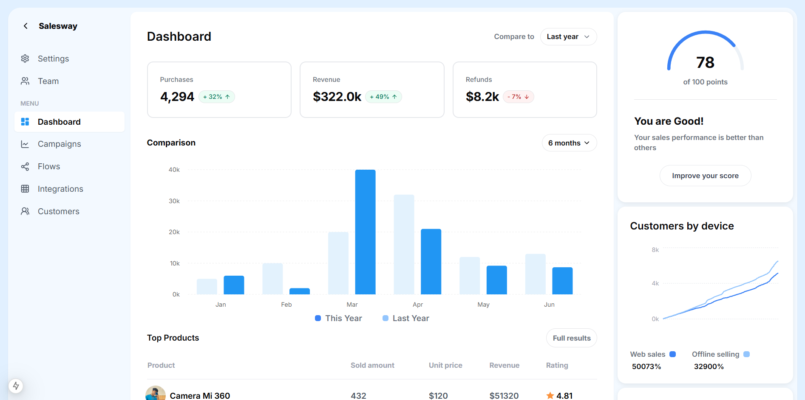
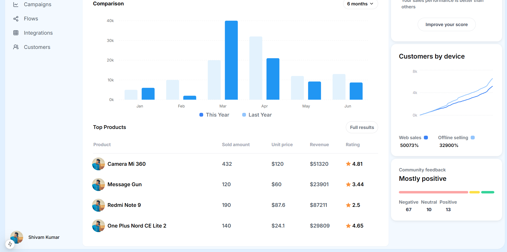

# Next.js + PostgreSQL Data Visualization






## Overview

This project is a Next.js application that integrates with a PostgreSQL database to fetch and visualize data. It includes:

1. A REST API for fetching table data from the database.
2. A frontend that dynamically renders a comparison chart using Recharts.
3. A secure database connection using SSL authentication.

## Features

1. Fetches data from a PostgreSQL database.
2. Dynamically displays data in a bar chart.
3. Handles errors gracefully for invalid table names and database failures.
4. Uses TypeScript for type safety and improved development experience.

## Tech Stack

* Next.js – Server-side rendering and API handling
* PostgreSQL – Database for storing records
* Recharts – Data visualization library for bar charts
* TypeScript – Static typing for better maintainability
* ShadCN Components – UI components for a modern design

## Setup Instructions

1️⃣ Clone the Repository

```
git clone https://github.com/shhiivvaam/frontend_assignment.git
cd frontend_assignment
```

2️⃣ Install Dependencies

```
npm install
```

3️⃣ Configure Environment Variables

Create a .env file in the root directory and add the following:

```
DB_USER=your_db_user
DB_HOST=your_db_host
DB_NAME=your_db_name
DB_PASS=your_db_password
DB_PORT=your_db_port
DB_URL=your_db_url
DB_SSL_CA=yout_db_ssl_ca
```

4️⃣ Run the Development Server

```
npm run dev
```

Then open http://localhost:3000 in your browser.

## API Endpoint

1. Fetch Data from Database

* GET /api/fetchData?table=sheet{sheet_id}

2. Query Params:

* table (string) – Required, the table name to fetch data from.


🛡️ Security Considerations

## Uses SSL certificates for a secure database connection.

1. Prevents SQL injection by using parameterized queries.
2. Handles API errors gracefully with proper response statuses.

```
ThankYou
```

### `Shivam`
